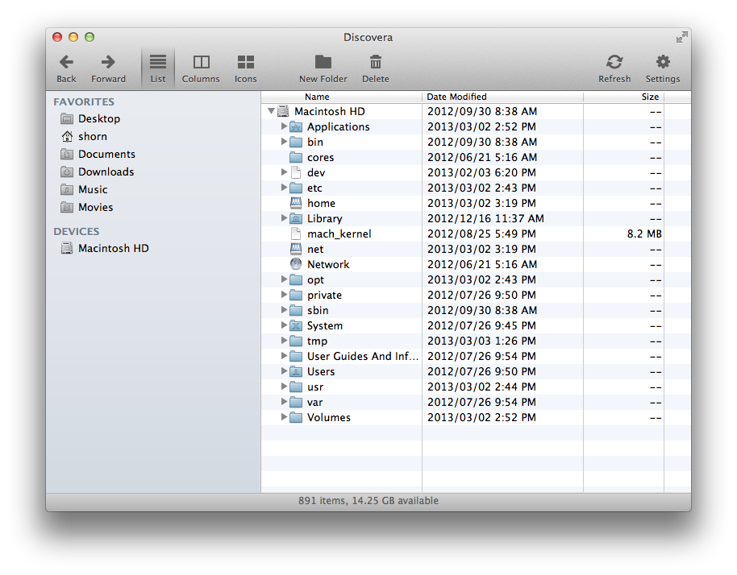

# Discovera 
_An adventure in finding files._

# Inspired by 

Making yet another file finder/explorer is was inspired by Kirby Ferguson's [Everything is a Remix: Part 3](http://www.amara.org/en/videos/DAAPo8OJkdip/info/everything-is-a-remix-part-3/)

    Put simply copying is how we learn
	We can't introduce anything new until we're fluent with the language of our domain and we do that through emulation
	For instance all artists spend their formative years producing derivative work
	Bob Dylan's first album contained eleven cover songs
	Richard Pryor began his stand-up career by making a not so good imitation of Bill Cosby
	And Hunter S. Thompson retyped the The Great Gatsby just to get the feel of writing a great novel
	Nobody starts out original
	Need copying until the foundation of knowledge and understanding
	And after that... things can get interesting …

#Attribution

* GradientHelper is based on [ Stavros Kounis "Stavros' Scratchpad"](http://skounis.blogspot.com.au/2008/06/gradient-background-to-any-swt-control.html)
* Toolbar fonts are generated from [ Font Awesome ](http://fortawesome.github.com/Font-Awesome/)
* The Application icon is based on a commerical free icon set from [Minicons Free Vector Icons Pack](http://www.webalys.com/minicons)
* The ability to run on the main thread without specifying -XstartOnFirstThread is thanks to [Silenio Quarti's code](https://bugs.eclipse.org/bugs/show_bug.cgi?id=389486)
* Correcting the top line of the tree/table header was based on the suggestion here by [gcbrueckmann on stack overflow](http://stackoverflow.com/questions/8263968/nstableheaderview-adds-a-line)
